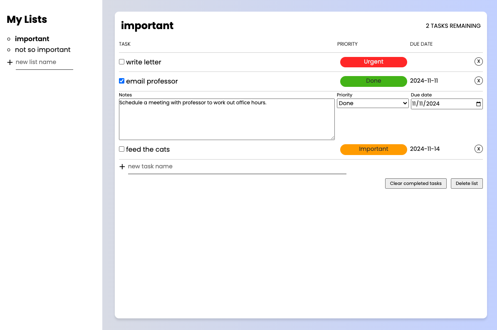

# todo-list
Todo list application on the web practicing using OOP.

There are 3 modules consisting of a simple todo module, a lists module which is the main todo application that handles all the functions and methods of manipulating the todo tasks and lists, and finally the index.js module which is the main screen controller.

The todo list application has a default starting list called "my first list" and uses local storage to save the current state. Lists can be created and deleted and tasks/todos inside each list can also be individually created/deleted or cleared all at once by its complete status.

Each todo can be clicked on (inside the space between the name and the priority tag) which will expand and allow the user to enter detailed notes, set priority tags and due-dates which are all optional.

[Live Demo](https://golfsap.github.io/todo-list/)

## Screenshot

